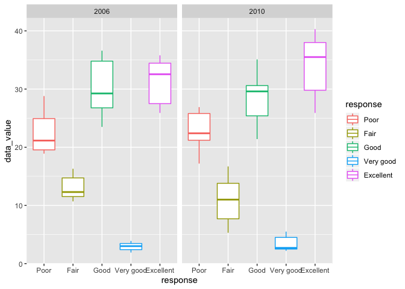

hw3\_jo2570
================
Jai Oberoi
09/10/2019

Loading in
    tidyverse

``` r
library(tidyverse)
```

    ## ── Attaching packages ─────────────────────────────────────────────── tidyverse 1.2.1 ──

    ## ✔ ggplot2 3.2.1     ✔ purrr   0.3.2
    ## ✔ tibble  2.1.3     ✔ dplyr   0.8.3
    ## ✔ tidyr   1.0.0     ✔ stringr 1.4.0
    ## ✔ readr   1.3.1     ✔ forcats 0.4.0

    ## ── Conflicts ────────────────────────────────────────────────── tidyverse_conflicts() ──
    ## ✖ dplyr::filter() masks stats::filter()
    ## ✖ dplyr::lag()    masks stats::lag()

Problem 1

Loading in Instacart data from the p8105 datasets:

``` r
library(p8105.datasets)
data("instacart")
```

Describing the Instacart data:

the size of the `instacart` dataset is 1384617 rows and 15 columns. we
can see that the average order hour of the day is 13.5775922 and the
median hour is 13.5775922. The average number of days since a prior
order for a user/customer is 17.0661259 and the median value is 15.

We can also get a breif run-down on the data by looking the results of
this skim code:

``` r
skimr::skim(instacart)
```

    ## Skim summary statistics
    ##  n obs: 1384617 
    ##  n variables: 15 
    ## 
    ## ── Variable type:character ─────────────────────────────────────────────────────────────
    ##      variable missing complete       n min max empty n_unique
    ##         aisle       0  1384617 1384617   3  29     0      134
    ##    department       0  1384617 1384617   4  15     0       21
    ##      eval_set       0  1384617 1384617   5   5     0        1
    ##  product_name       0  1384617 1384617   3 159     0    39123
    ## 
    ## ── Variable type:integer ───────────────────────────────────────────────────────────────
    ##                variable missing complete       n       mean        sd p0
    ##       add_to_cart_order       0  1384617 1384617       8.76      7.42  1
    ##                aisle_id       0  1384617 1384617      71.3      38.1   1
    ##  days_since_prior_order       0  1384617 1384617      17.07     10.43  0
    ##           department_id       0  1384617 1384617       9.84      6.29  1
    ##               order_dow       0  1384617 1384617       2.7       2.17  0
    ##       order_hour_of_day       0  1384617 1384617      13.58      4.24  0
    ##                order_id       0  1384617 1384617 1706297.62 989732.65  1
    ##            order_number       0  1384617 1384617      17.09     16.61  4
    ##              product_id       0  1384617 1384617   25556.24  14121.27  1
    ##               reordered       0  1384617 1384617       0.6       0.49  0
    ##                 user_id       0  1384617 1384617   1e+05     59487.15  1
    ##     p25     p50     p75    p100     hist
    ##       3       7      12      80 ▇▃▁▁▁▁▁▁
    ##      31      83     107     134 ▃▇▃▃▇▅▅▆
    ##       7      15      30      30 ▂▅▃▃▁▂▁▇
    ##       4       8      16      21 ▃▇▂▁▂▆▁▃
    ##       1       3       5       6 ▇▅▃▃▁▃▅▅
    ##      10      14      17      23 ▁▁▃▇▇▇▅▂
    ##  843370 1701880 2568023 3421070 ▇▇▇▇▇▇▇▇
    ##       6      11      21     100 ▇▂▁▁▁▁▁▁
    ##   13380   25298   37940   49688 ▆▆▇▇▇▆▇▇
    ##       0       1       1       1 ▆▁▁▁▁▁▁▇
    ##   51732   1e+05  154959  206209 ▇▇▇▇▇▇▇▇

``` r
instacart %>%
  count(aisle_id) %>%
  arrange(desc(n))
```

    ## # A tibble: 134 x 2
    ##    aisle_id      n
    ##       <int>  <int>
    ##  1       83 150609
    ##  2       24 150473
    ##  3      123  78493
    ##  4      120  55240
    ##  5       21  41699
    ##  6      115  36617
    ##  7       84  32644
    ##  8      107  31269
    ##  9       91  26240
    ## 10      112  23635
    ## # … with 124 more rows

Aisles 83 and 24 have the most products ordered with a count of over
150,000

Creating a plot showing the number of items ordered in each aisle,
limiting this to aisles with more than 10000 items ordered:

``` r
instacart %>%
  count(aisle_id) %>%
  filter(n > 10000) %>%
  ggplot(aes(x = aisle_id, y = n)) + geom_line() + 
  labs( title = "Number of Items Ordered for Aisles with n > 10000", x = "Aisle", y = "Number of Items Ordered")
```

<!-- -->

Creating a table showing the three most popular items in each of the
aisles “baking ingredients”, “dog food care”, and “packaged vegetables
fruits”:

``` r
instacart %>%
     filter(aisle %in% c("baking ingredients", 
            "dog food care", 
            "packaged vegetables fruits")) %>%
  group_by(aisle, product_name) %>% 
  summarize(n = n()) %>%
  top_n(3) %>%
  arrange(desc(n)) %>%
  knitr::kable()
```

    ## Selecting by n

| aisle                      | product\_name                                 |    n |
| :------------------------- | :-------------------------------------------- | ---: |
| packaged vegetables fruits | Organic Baby Spinach                          | 9784 |
| packaged vegetables fruits | Organic Raspberries                           | 5546 |
| packaged vegetables fruits | Organic Blueberries                           | 4966 |
| baking ingredients         | Light Brown Sugar                             |  499 |
| baking ingredients         | Pure Baking Soda                              |  387 |
| baking ingredients         | Cane Sugar                                    |  336 |
| dog food care              | Snack Sticks Chicken & Rice Recipe Dog Treats |   30 |
| dog food care              | Organix Chicken & Brown Rice Recipe           |   28 |
| dog food care              | Small Dog Biscuits                            |   26 |

Creating a table showing the mean hour of the day at which Pink Lady
Apples and Coffee Ice Cream are ordered on each day of the week:

``` r
instacart %>%
  filter(product_name %in% c("Pink Lady Apples", "Coffee Ice Cream")) %>%
  group_by(product_name, order_dow) %>%
  summarise(mean_order_hour_of_day = mean(order_hour_of_day)) %>%
  select(product_name, order_dow, mean_order_hour_of_day) %>%
  pivot_wider(
    names_from = order_dow,
    values_from = mean_order_hour_of_day
  ) %>%
  knitr::kable()
```

| product\_name    |        0 |        1 |        2 |        3 |        4 |        5 |        6 |
| :--------------- | -------: | -------: | -------: | -------: | -------: | -------: | -------: |
| Coffee Ice Cream | 13.77419 | 14.31579 | 15.38095 | 15.31818 | 15.21739 | 12.26316 | 13.83333 |
| Pink Lady Apples | 13.44118 | 11.36000 | 11.70213 | 14.25000 | 11.55172 | 12.78431 | 11.93750 |

Problem 2

Loading in the BRFSS dataset:

``` r
data("brfss_smart2010")
```

Cleaning the BRFSS dataset:

``` r
brfss_clean = brfss_smart2010 %>%
  janitor::clean_names() %>%
  filter(topic %in% c("Overall Health"),
         response %in% c("Excellent", "Very good", "Good", "Fair", "Poor")) %>%
  mutate(response = factor(response, labels = c("Poor","Fair","Good","Very good", "Excellent"))) 
```

To find out which states were observed at 7 or more locations in 2002:

``` r
brfss_clean %>% 
  filter(year == "2002") %>% 
  group_by(locationabbr) %>%
  summarize(
    n = n_distinct(geo_location)) %>%
  filter(n > 6) %>% 
  arrange(desc(n))
```

    ## # A tibble: 6 x 2
    ##   locationabbr     n
    ##   <chr>        <int>
    ## 1 PA              10
    ## 2 MA               8
    ## 3 NJ               8
    ## 4 CT               7
    ## 5 FL               7
    ## 6 NC               7

PA, MA, NJ, CT, FL, NC

To find out which states were observed at 7 or more locations in 2010:

``` r
brfss_clean %>% 
  filter(year == "2010") %>% 
  group_by(locationabbr) %>%
  summarize(
    n = n_distinct(geo_location)) %>%
  filter(n > 6) %>% 
  arrange(desc(n)) 
```

    ## # A tibble: 14 x 2
    ##    locationabbr     n
    ##    <chr>        <int>
    ##  1 FL              41
    ##  2 NJ              19
    ##  3 TX              16
    ##  4 CA              12
    ##  5 MD              12
    ##  6 NC              12
    ##  7 NE              10
    ##  8 WA              10
    ##  9 MA               9
    ## 10 NY               9
    ## 11 OH               8
    ## 12 CO               7
    ## 13 PA               7
    ## 14 SC               7

FL, NJ, TX, CA, MD, NC, NE, WA, MA, NY, OH, CO, PA, SC

Limiting the cleaned dataset to only “Excellent” responses:

``` r
brfss_excellent = brfss_clean %>% 
  filter(response == "Excellent") %>% 
  group_by(locationabbr, year, response) %>%
  summarise(mean_data_value = mean(data_value))
```

Creating a “spaghetti” plot of this average value over time within a
state (from
brfss\_excellent):

``` r
ggplot(brfss_excellent, aes(x = year, y = mean_data_value, color = locationabbr)) + 
  geom_line(se = FALSE, na.rm = TRUE)
```

    ## Warning: Ignoring unknown parameters: se

<!-- -->

Creating a two-panel plot showing, for the years 2006, and 2010,
distribution of data\_value for responses (“Poor” to “Excellent”) among
locations in NY State:

``` r
brfss_ny = brfss_clean %>%
  filter(topic %in% c("Overall Health"), 
         year %in% c("2006", "2010"),
         response %in% c("Excellent", "Very good", "Good", "Fair", "Poor"),
         locationabbr %in% c("NY"))

brfss_ny %>% 
  ggplot(aes(x = response, y = data_value, color = year)) + geom_point() + facet_grid(.~year)
```

<!-- -->

Problem 3
